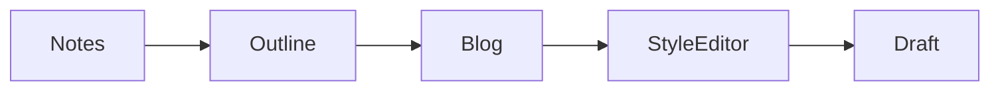

# AI Blog Writing Agent

This project is an AI system that converts my **weekly notes into a draft Medium blog post**.

Instead of writing blogs from scratch, the system:

1. Reads my weekly notes
2. Generates a structured outline
3. Writes a blog draft
4. Adjusts the style to match my previous Medium articles
5. Automatically generates diagrams where needed
6. Saves a draft I can review and publish

The goal is to **document my developer learning journey while minimizing writing effort**.

---

# System Architecture

The system runs a multi-step AI pipeline:

```
Medium posts → style extraction
notes → outline → blog → style edit → diagram generation → final draft
```

Each step uses a specialized prompt and module.

---

# Pipeline Steps

## 1. Style Fetcher

Before generating a blog, the system automatically fetches my **latest Medium posts** and extracts writing examples.

These examples are stored in:

```
scripts/prompts/style_examples.txt
```

This allows the AI to imitate my writing style.

Module:

```
scripts/style_fetcher.py
```

---

## 2. Notes Reader

The system reads notes from the `src` folder.

Each week has its own file:

```
src/
├── 2026-03-07_notes.md
├── 2026-03-14_notes.md
```

The system automatically selects **the newest notes file**.

Module:

```
scripts/note_reader.py
```

---

## 3. Outline Generator

The first AI writing step converts notes into a **clear article outline**.

Example output:

```
## Why I Built This Agent
## Experimenting with Groq APIs
## Building the Blog Pipeline
## Lessons Learned
```

Module:

```
scripts/outline_generator.py
```

Prompt:

```
scripts/prompts/outline_prompt.txt
```

---

## 4. Blog Writer

The outline is expanded into a full Medium blog draft.

The blog may contain diagram placeholders such as:

```
<insert image: architecture diagram showing the blog generation pipeline>
```

Module:

```
scripts/blog_writer.py
```

Prompt:

```
scripts/prompts/blog_prompt.txt
```

---

## 5. Style Editor

The draft is rewritten to better match my writing style using examples extracted from my Medium posts.

Module:

```
scripts/style_editor.py
```

Prompt:

```
scripts/prompts/edit_prompt.txt
```

---

## 6. Diagram Generator

When the blog contains placeholders like:

```
<insert image: description>
```

the system converts them into **Mermaid diagrams** automatically.

Example:

```
<insert image: architecture diagram showing the pipeline>
```

becomes



Module:

```
scripts/diagram_generator.py
```

Prompt:

```
scripts/prompts/diagram_prompt.txt
```

---

# Project Structure

```
agent-blog
│
├── drafts/                    # Generated blog drafts
│
├── src/                       # Weekly notes
│   ├── 2026-03-07_notes.md
│   └── 2026-03-14_notes.md
│
├── scripts/
│   ├── main.py                # Runs the pipeline
│   ├── config.py              # Loads environment variables
│   ├── note_reader.py
│   ├── outline_generator.py
│   ├── blog_writer.py
│   ├── style_editor.py
│   ├── diagram_generator.py
│   ├── style_fetcher.py
│   ├── file_writer.py
│   ├── llm_client.py
│   │
│   └── prompts/
│       ├── outline_prompt.txt
│       ├── blog_prompt.txt
│       ├── edit_prompt.txt
│       ├── diagram_prompt.txt
│       └── style_examples.txt
│
├── venv/
├── .env
└── README.md
```

---

# Running the Agent

## 1. Open the project

Open the `agent-blog` folder in VS Code.

---

## 2. Open the terminal

```
Terminal → New Terminal
```

---

## 3. Activate the environment

```
source venv/bin/activate
```

---

## 4. Add weekly notes

Create a new file in `src`:

```
src/2026-03-21_notes.md
```

Example:

```
This week I experimented with Groq APIs.

I built a multi-step AI pipeline:

notes → outline → blog → style edit → diagrams

The hardest part was matching my writing style.
```

---

## 5. Run the agent

```
python scripts/main.py
```

Expected output:

```
Updating writing style from Medium...
Generating outline...
Writing blog draft...
Applying style editor...
Generating diagrams...
Blog saved to drafts/2026-03-21_blog.md
```

---

## 6. Review the generated draft

Open:

```
drafts/2026-03-21_blog.md
```

Edit the content if needed and publish to Medium.

---

# Weekly Workflow

Each week:

1. Create a new notes file

```
src/YYYY-MM-DD_notes.md
```

2. Run the generator

```
python scripts/main.py
```

3. Review the generated draft

```
drafts/YYYY-MM-DD_blog.md
```

4. Add diagrams or images if needed
5. Publish to Medium

---

# Summary

This system converts developer notes into structured blog drafts using AI.

Pipeline:

```
Medium posts → style extraction
notes → outline → blog → style edit → diagrams → draft
```

Each notes file maps directly to a generated blog draft.

Example:

```
src/2026-03-14_notes.md
        ↓
drafts/2026-03-14_blog.md
```

This creates a clean archive of both **notes and generated blogs** over time.
